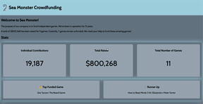

# WEB102 Prework - Track your Funding

Submitted by: Carlos Ortiz

Track your Funding is a website for the company Sea Monster Crowdfunding that displays information about the games they have funded.

Time spent: 5 hours spent in total

## Required Features

The following **required** functionality is completed:

- [x] The introduction section explains the background of the company and how many games remain unfunded.
- [x] The Stats section includes information about the total contributions and dollars raised as well as the top two most funded games.
- [x] The Our Games section initially displays all games funded by Sea Monster Crowdfunding
- [x] The Our Games section has three buttons that allow the user to display only unfunded games, only funded games, or all games.

The following **optional** features are implemented:

- [x] Add "Cursor: Pointer" to the buttons

## Video Walkthrough

Here's a walkthrough of implemented features:

<!-- Replace this with whatever GIF tool you used! -->

GIF created with Kap

<!-- Recommended tools:
[Kap](https://getkap.co/) for macOS
[ScreenToGif](https://www.screentogif.com/) for Windows
[peek](https://github.com/phw/peek) for Linux. -->

## Notes

Describe any challenges encountered while building the app.

The major challenge I faced was uploading the project onto github. I had another repository before this one where I had everything but the gif file was to large and tried pushing but failed.
After this, I made it smaller and smaller and it still would not push onto the repository on github. I then decided that something was wrong with the past commits, and so I tried deleting
some of my past commits but then I made a bit of a mess and so I decided to fork it again and just copy all my code from my old repository and upload the small gif and upon doing so,
it immediately worked and I was able to upload everything.

## License

    Copyright 2023 Carlos Ortiz

    Licensed under the Apache License, Version 2.0 (the "License");
    you may not use this file except in compliance with the License.
    You may obtain a copy of the License at

        http://www.apache.org/licenses/LICENSE-2.0

    Unless required by applicable law or agreed to in writing, software
    distributed under the License is distributed on an "AS IS" BASIS,
    WITHOUT WARRANTIES OR CONDITIONS OF ANY KIND, either express or implied.
    See the License for the specific language governing permissions and
    limitations under the License.
